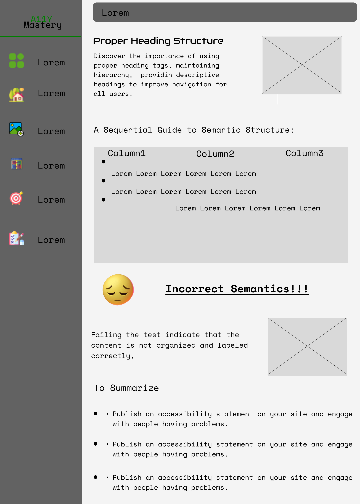

> Hello, world! This is the project’s summary that describes the project plain and simple, limited to the space available. 

### User Stories

- As a user, I want to be able to sign up for an account on the website so that I can access the accessibility testing tool.
- As a user, I want to be able to log in to my account securely to access the accessibility testing tool and manage my testing projects.
- As a user, I want to be able to upload the source code or URL of a web page to the testing tool so that it can be analyzed for accessibility issues.
- As a user, I want to have access to a knowledge base or documentation that provides guidance on understanding and fixing different types of accessibility issues.
- As a user, I want to be able to mark what i have accomplish concerning my website accessibility.

<br><br>

<!-- Prototyping -->
<!--  -->

> We designed A11Y Mastery using wireframes and mockups, iterating on the design until we reached the ideal layout for easy navigation and a seamless user experience.

### Wireframes
| Sign up | Sign in | Landing page  | 
| ------ | ------ | ------ | 
|  |  |  |

| Semantics | Usability | Check list |
| ------ | ------ | ------ | 
|  |  |  | 

| Test | Images |
| ------ | ------ | ------ | 
|  |  | 

### Mockups
| Sign up | Sign in | Landing page  | 
| ------ | ------ |  ------ |
|  |  | 

| Semantics | Usability | Check list |
| ------ | ------ | ------ | 
|  |  |  | 

| Test | Images |
| ------ | ------ | ------ | 
|  |  | 


<br><br>

<!-- Tech stack -->


###  A11Y Mastery is built using the following technologies:

- This project uses the [React JS development framework](https://reactjs.org/). React is a declarative, efficient, and flexible JavaScript library for building SPA (single web application) and user interfaces or UI components. It lets you compose complex UIs from small and isolated pieces of code called “components”.


-This project also uses [Framer-Motion] in order to animate components and add fun transitions between pages.

- The app uses the font ["mono space"](https://fonts.googleapis.com/css2?family=Audiowide&display=swap) as its main font, and the design of the app adheres to the material design guidelines.

<br><br>

<!-- How to run -->

> To set up A11Y Mastery locally, follow these steps:

### Prerequisites

This is an example of how to list things you need to use the software and how to install them.
* npm
  ```sh
  npm install npm@latest -g
  ```

### Installation

_Below is an example of how you can instruct your audience on installing and setting up your app. This template doesn't rely on any external dependencies or services._


1. Clone the repo
   ```sh
   git clone https://github.com/mohamad-kareem/ACCESSIBILITY_TESTING_TOOL.git
   ```

6.  initialize App

    ````js
    //mobile
    npm start

Now, you should be able to run A11Y Mastery Express locally and explore its features.